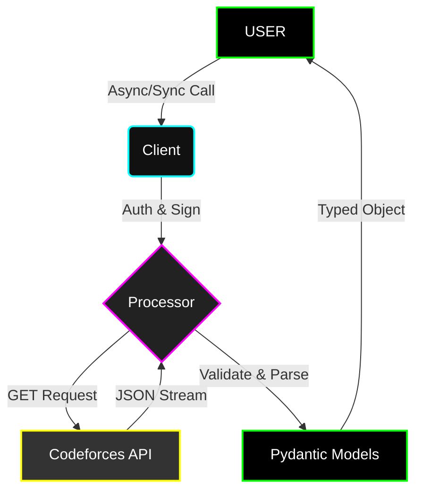

<div align="center">

# ⚡ C O D E F O R C E S P Y ⚡
### <span style="font-family: monospace;">HIGH PERFORMANCE. ASYNC. TYPE-SAFE.</span>

[](https://pypi.org/project/codeforcespy/)
[](https://python.org)
[](LICENSE)
[](tests/)


<br>

</div>

---

# 👁️ INTRODUCTION

**codeforcespy** is a high-performance, strictly type-safe Python library designed for interaction with the **Codeforces API**. 

It provides both **synchronous** and **asynchronous** clients, ensuring seamless integration into any architecture. Built with modern standards, it offers complete type coverage, making it ideal for building contest bots, analysis tools, or educational platforms.

### 🔥 KEY FEATURES
- **High Performance**: Powered by `httpx` for efficient async networking.
- **Type Safety**: 100% Typed codebase using generic protocols. No `Any`.
- **Reliability**: Robust error handling and automatic retry mechanisms.
- **Dual Mode**: Full support for both `SyncClient` and `AsyncClient` with identical API signatures.

---

# 📦 I N S T A L L A T I O N

Install the package via pip:

```bash
pip install codeforcespy
```

*For development dependencies:*

```bash
pip install codeforcespy[dev]
```

---

# 🔌 Q U I C K S T A R T

## ⚡ ASYNC CLIENT (RECOMMENDED)
*Non-blocking implementation for high-concurrency applications.*

```python
import asyncio
from codeforcespy import AsyncClient

async def main():
    # Initialize the client
    client = AsyncClient()

    try:
        # Fetch user information
        user = await client.get_user(handles="tourist")
        print(f"👤 User: {user[0].handle} | Rating: {user[0].rating}")

        # List active contests
        contests = await client.get_contest_list(of_gym=False)
        print(f"🏆 Found {len(contests)} active contests.")

    finally:
        # Proper resource cleanup
        await client.close()

if __name__ == "__main__":
    asyncio.run(main())
```

## 🐢 SYNC CLIENT
*Blocking implementation for scripts and simple tools.*

```python
from codeforcespy import SyncClient

def main():
    # Context manager handles cleanup automatically
    with SyncClient() as client:
        # Fetch user information
        user = client.get_user(handles="tourist")
        print(f"👤 User: {user[0].handle}")
        
        # Access rating history
        rating_history = client.get_user_rating(handle="tourist")
        print(f"📉 Found {len(rating_history)} rating changes.")

if __name__ == "__main__":
    main()
```

---

# 📚 API REFERENCE

Codeforcespy provides full coverage of the public API endpoints.

## 👤 USER METHODS (`User`)
*Operations related to user profiles and activity.*

| Method | Description |
| :--- | :--- |
| `get_user(handles="a;b")` | Retrieve profile info for one or multiple handles. |
| `get_user_rating(handle)` | Get the full rating history trajectory. |
| `get_user_status(handle, count=10)` | Pull recent submissions. Supports paging. |
| `get_user_friends(only_online=True)` | **[AUTH REQ]** List friends. |
| `get_user_blog_entries(handle)` | Get all blog posts by a user. |

<details>
<summary><b>🔍 View Examples</b></summary>

```python
# Get multiple users
users = await client.get_user("tourist;Petr")
for u in users:
    print(f"{u.handle} -> {u.rank}")

# Inspect recent submissions
subs = await client.get_user_status("tourist", count=5)
for s in subs:
    print(f"Problem: {s.problem.name} | Verdict: {s.verdict}")
```
</details>

## 🏆 CONTEST METHODS (`Contest`)
*Operations related to contests and standings.*

| Method | Description |
| :--- | :--- |
| `get_contest_list(of_gym=False)` | List all available contests. |
| `get_contest_standings(contest_id, ...)` | Get full ranklist with hacks & problems. |
| `get_contest_status(contest_id)` | Get live submissions for a contest. |
| `get_contest_hacks(contest_id)` | Retrieve list of hacks. |
| `get_contest_rating_changes(contest_id)` | Retrieve rating updates for a contest. |

<details>
<summary><b>🔍 View Examples</b></summary>

```python
# Get top 5 standings
standings = await client.get_contest_standings(
    contest_id=1234, 
    from_index=1, 
    count=5, 
    show_unofficial=True
)

for row in standings:
    print(f"Rank {row.rank}: {row.party.members[0].handle}")
```
</details>

## 🧩 PROBLEMSET METHODS (`Problemset`)
*Operations related to the problem archive.*

| Method | Description |
| :--- | :--- |
| `get_problemset_problems(tags="dp;math")` | Search problems by tags. |
| `get_problemset_recent_status(count=10)` | Live feed of all submissions. |

## 📰 BLOG & RECENT (`Blog`, `Recent`)
*Operations related to content and global activity.*

| Method | Description |
| :--- | :--- |
| `get_blog_entry_view(blog_entry_id)` | Read a blog post. |
| `get_blog_entry_comments(blog_entry_id)` | Read the comments section. |
| `get_recent_actions(max_count=30)` | Get global recent actions. |

---

# 🔐 A U T H E N T I C A T I O N

To access private data (friends, mashups, etc.), you must provide your **API Key** and **Secret**.

1. Go to [codeforces.com/settings/api](https://codeforces.com/settings/api).
2. Create a new key.
3. specificy credentials when initializing the client:

```python
client = AsyncClient(
    api_key="YOUR_KEY_HERE",
    api_secret="YOUR_SECRET_HERE"
)

# Authorized request
friends = await client.get_user_friends()
```

---

# 🏗️ A R C H I T E C T U R E

<div align="center">



</div>

---

<div align="center">

### 🤝 CONTRIBUTING

Found a bug? Want to request a feature?
[**Open an Issue on GitHub**](https://github.com/xsyncio/codeforcespy)

<br>


</div>
